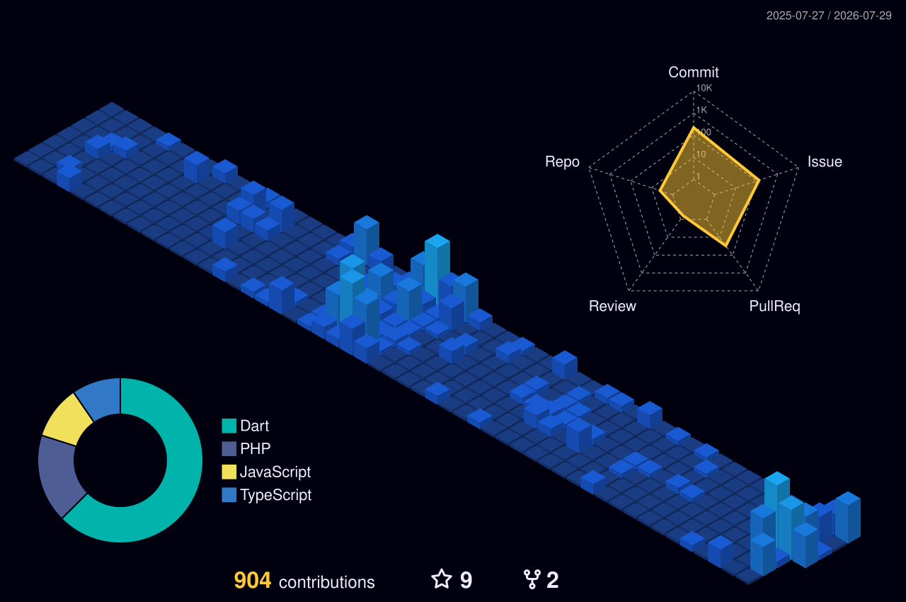
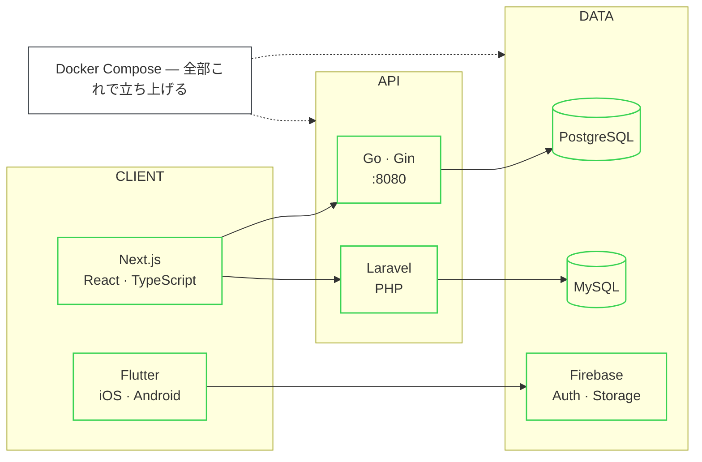

<!-- ========================= HEADER ========================= -->

  

<!-- 文言は lines= の中身をセミコロン区切りで編集 -->

  

<!-- ========================= BOOT LOG =========================
     scripts/bootlog.mjs が GitHub API から実データを取って生成する。
     数字はすべて本物（リポジトリ数・言語比率・最終pushなど）。 -->

  

<!-- ========================= 3D CONTRIBUTION =========================
     .github/workflows/profile.yml が生成。差し替え候補:
       profile-night-view.svg    夜景（これ）
       profile-night-rainbow.svg 夜景・虹色
       profile-gitblock.svg      マイクラのブロック風
       profile-season-animate.svg 季節で色が変わる + アニメーション -->

  

<!-- ========================= SNAKE =========================
     .github/workflows/snake.yml が output ブランチに生成 -->

  <picture>
    <source media="(prefers-color-scheme: dark)" srcset="https://raw.githubusercontent.com/shimano-yuuki/shimano-yuuki/output/snake-dark.svg" />
    <source media="(prefers-color-scheme: light)" srcset="https://raw.githubusercontent.com/shimano-yuuki/shimano-yuuki/output/snake.svg" />
    
  </picture>

<!-- ========================= STATS ========================= -->

  
  

  

<!-- ========================= ARCHITECTURE =========================
     mermaid は GitHub がネイティブでレンダリングする（画像じゃないので
     ダークモードにも自動追従し、外部サービスにも依存しない）。 -->

<!-- ========================= STACK =========================
     アイコン一覧: https://skillicons.dev -->

  

<!-- ========================= BADGES ========================= -->

  
  
  

<!-- ========================= WORKS =========================
     作ったアプリの動作GIFを assets/ に置いてコメントを外す。
     シミュレータの画面収録を GIF にして 3本並べるのが一番効く。

  
  
  

-->

  

