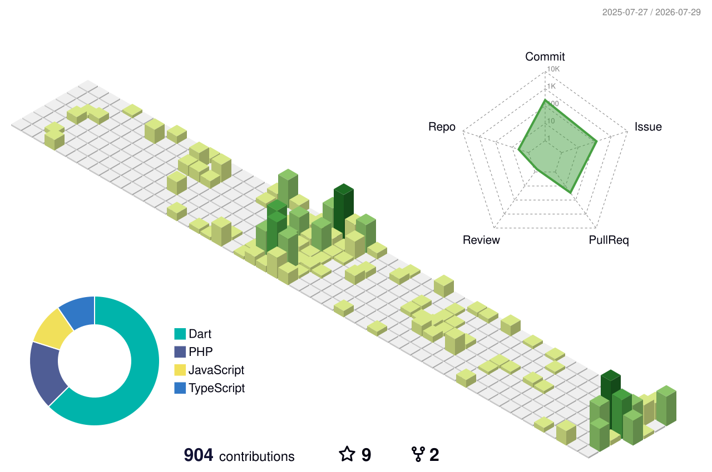
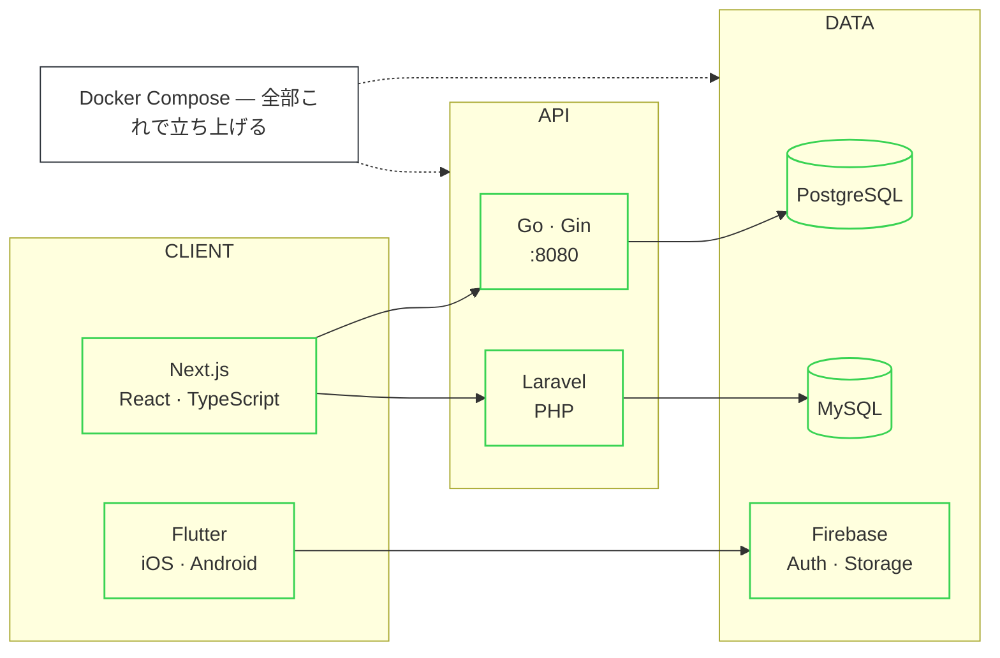

<!-- 自作SVG。文言・スタックは scripts/brand.mjs を編集して再生成する。
     色は scripts/theme.mjs に集約してあるので、変えると全部の自作SVGに効く。 -->

  

<!-- 実データのブートログ。scripts/bootlog.mjs が GitHub API から生成する。 -->

  

<!-- 草を食べる蛇。.github/workflows/snake.yml が output ブランチに生成する。 -->

  <picture>
    <source media="(prefers-color-scheme: dark)" srcset="https://raw.githubusercontent.com/shimano-yuuki/shimano-yuuki/output/snake-dark.svg" />
    <source media="(prefers-color-scheme: light)" srcset="https://raw.githubusercontent.com/shimano-yuuki/shimano-yuuki/output/snake.svg" />
    
  </picture>

<!-- 3D草グラフ。蛇と同じデータの別表現なので普段は出さない。
     入れ替えたいときは蛇のブロックと差し替える。
     profile.yml が profile-3d-contrib/ 以下に複数の絵柄を生成している。

  

-->

  

<!-- statsカードは vercel から直リンクせず profile.yml で取得して保存したものを使う。
     vercel が落ちても README が壊れない。 -->

  
  

<!-- 年間アクティビティの折れ線。蛇と同じデータなので普段は出さない。

  

-->

## 最近書いたコード

<!-- ここから ↓ は scripts/activity.mjs が自動生成する。 -->
<!-- activity starts -->
_初回の `generate profile assets` 実行で埋まります。_
<!-- activity ends -->

## 構成

<!-- mermaid は GitHub がネイティブでレンダリングする。画像ではないので
     ダークモードに自動追従し、外部サービスにも依存しない。 -->

## じゃんけん

<!-- ここから ↓ は scripts/janken.mjs が自動生成する。手で書き換えても次の対戦で上書きされる。 -->
<!-- janken starts -->

押すとIssueが立ち、数秒後にBotが手を出して結果を返します。

  
  
  

`BOT 1W` &nbsp;·&nbsp; `1L` &nbsp;·&nbsp; `0D` &nbsp;·&nbsp; `win rate 50%` &nbsp;·&nbsp; `2 games`

| 結果 | 挑戦者 | 挑戦者の手 | BOTの手 | |
|---|---|---|---|---|
| `YOU WIN` | @shimano-yuuki | ✌️ チョキ | ✋ パー | 2m ago |
| `BOT WIN` | @shimano-yuuki | ✋ パー | ✌️ チョキ | 5m ago |
<!-- janken ends -->

<!-- 作ったアプリの動作GIFを assets/ に置いてコメントを外す。
     シミュレータの画面収録を GIF にして 3本並べるのが一番効く。
## つくったもの

  
  
  

-->

  

